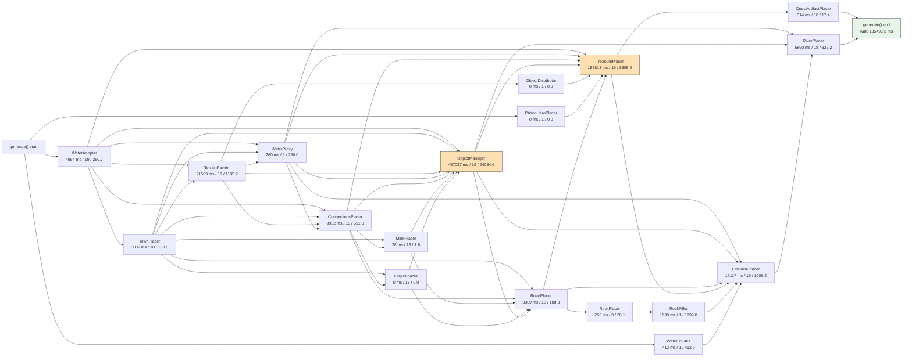

# RMG pipeline latencies (Clash of Dragons, 252x252x2)

Scenario used for both diagrams:
- template: `vcmi:Clash of Dragons`
- map: `252x252x2`
- scheduler: `parallel`
- workers: `16`
- seed: `1`
- timestamp: `1742174175`
- benchmark args: `--warmup 0 --runs 1`

Commits:
- old: `f88934907797d3b84421efca11f8c79021ccf8d8`
- new: `10959297f8a0004a6db66ebe5b921a43c3111551`

Latency labels on nodes are cumulative per-node execution time from this run:
`total ms / calls / avg ms`. This is not wall-clock critical-path time; nodes run in
parallel and overlap.

Wall-clock benchmark result:
- old: `13549.73 ms`
- new: `15466.75 ms`

## Old pipeline (`f889349...`)

## New pipeline (`10959297f...`)

