# RMG worker timeline DAGs (Clash of Dragons, 252x252x2)

Scenario used for both diagrams:
- template: `vcmi:Clash of Dragons`
- map: `252x252x2`
- scheduler: `parallel`
- workers requested: `16`
- seed: `1`
- timestamp: `1742174175`
- benchmark args: `--warmup 0 --runs 1`

Commits:
- old: `f88934907797d3b84421efca11f8c79021ccf8d8`
- new: `10959297f8a0004a6db66ebe5b921a43c3111551`

Legend:
- solid edge `-->`: consecutive execution on the same worker (timeline chain)
- dashed edge `-.->`: inter-thread dependency edge (DAG)
- node format: `XX#N X.XXXs`
  - `XX`: short task code
  - `N`: task occurrence index in that run
  - `X.XXXs`: wall duration of this work item

Task codes:
- `PH` PrisonHeroPlacer, `WA` WaterAdopter, `TW` TownPlacer, `TE` TerrainPainter
- `WP` WaterProxy, `CN` ConnectionsPlacer, `MI` MinePlacer, `OP` ObjectPlacer
- `OM` ObjectManager, `RD` RoadPlacer, `OD` ObjectDistributor, `TR` TreasurePlacer
- `WR` WaterRoutes, `RP` RockPlacer, `RF` RockFiller, `OB` ObstaclePlacer
- `RV` RiverPlacer, `QA` QuestArtifactPlacer

Wall-clock benchmark result for this capture:
- old: `13705.32 ms`
- new: `15755.33 ms`

Graph sizes: old workers `15`, chain edges `220`, dependency edges `204`.
Graph sizes: new workers `16`, chain edges `219`, dependency edges `211`.

## Old timeline DAG (`f889349...`)

```mermaid
flowchart LR
  %% old timeline DAG
  subgraph W1["Worker 1"]
    n1["PH#1 0.000s"]
    n2["WA#1 0.000s"]
    n3["WA#2 0.000s"]
    n37["WA#19 0.801s"]
    n38["TE#1 0.067s"]
    n53["TE#15 1.947s"]
    n106["CN#17 1.135s"]
    n108["OP#16 0.000s"]
    n117["OM#3 6.847s"]
    n149["OM#9 21.968s"]
    n150["TR#9 1.514s"]
    n151["OB#6 0.595s"]
  end
  subgraph W2["Worker 2"]
    n4["WA#3 0.000s"]
    n6["WA#5 0.000s"]
    n8["WA#7 0.000s"]
    n33["WA#17 0.707s"]
    n34["TW#16 0.028s"]
    n52["TW#18 1.958s"]
    n57["TE#19 0.441s"]
    n59["WP#1 0.249s"]
    n96["CN#13 0.863s"]
    n97["MI#13 0.000s"]
    n167["OM#17 45.766s"]
    n168["RD#16 0.314s"]
    n180["TR#16 16.656s"]
    n183["RP#3 0.007s"]
    n192["OB#8 0.226s"]
    n193["RV#7 0.160s"]
    n223["QA#8 0.000s"]
  end
  subgraph W3["Worker 3"]
    n5["WA#4 0.000s"]
    n7["WA#6 0.000s"]
    n9["WA#8 0.000s"]
    n10["WA#9 0.000s"]
    n16["TW#5 0.139s"]
    n26["TW#12 0.000s"]
    n40["TE#3 0.265s"]
    n55["TE#17 1.845s"]
    n58["OD#1 0.007s"]
    n90["CN#11 0.703s"]
    n91["OP#11 0.000s"]
    n172["OM#19 48.629s"]
    n173["RD#18 0.617s"]
    n215["TR#19 19.858s"]
    n216["QA#1 0.000s"]
    n225["QA#10 0.016s"]
  end
  subgraph W4["Worker 4"]
    n11["WA#10 0.000s"]
    n15["TW#4 0.075s"]
    n49["TE#12 1.640s"]
    n60["CN#1 0.096s"]
    n61["CN#2 0.063s"]
    n77["CN#7 0.216s"]
    n79["MI#6 0.000s"]
    n82["OP#8 0.000s"]
    n116["OM#2 5.787s"]
    n159["OM#14 34.788s"]
    n161["RD#13 0.203s"]
    n174["TR#12 9.013s"]
    n189["RP#9 0.046s"]
    n191["RF#1 1.943s"]
    n198["OB#11 0.996s"]
    n205["RV#11 0.412s"]
    n226["QA#11 0.019s"]
  end
  subgraph W5["Worker 5"]
    n12["TW#1 0.000s"]
    n13["TW#2 0.000s"]
    n18["TW#7 0.196s"]
    n21["TW#9 0.000s"]
    n41["TE#4 0.410s"]
    n56["TE#18 1.779s"]
    n105["CN#16 1.136s"]
    n107["MI#16 0.000s"]
    n109["MI#17 0.000s"]
    n110["OP#17 0.000s"]
    n118["OM#4 10.205s"]
    n163["OM#15 33.706s"]
    n164["RD#14 0.312s"]
    n190["TR#17 20.155s"]
    n210["OB#17 2.099s"]
    n211["RV#16 0.766s"]
    n224["QA#9 0.000s"]
  end
  subgraph W6["Worker 6"]
    n14["TW#3 0.000s"]
    n24["TW#11 0.199s"]
    n45["TE#8 1.023s"]
    n84["CN#9 0.545s"]
    n85["OP#9 0.000s"]
    n86["MI#9 0.000s"]
    n128["OM#6 13.365s"]
    n130["TR#4 1.379s"]
    n136["OB#2 1.111s"]
    n137["RV#2 0.526s"]
    n182["RP#2 0.004s"]
    n203["OB#16 1.292s"]
    n208["RV#14 0.298s"]
  end
  subgraph W7["Worker 7"]
    n17["TW#6 0.193s"]
    n43["TE#6 0.641s"]
    n93["CN#12 0.854s"]
    n94["MI#12 0.000s"]
    n95["OP#12 0.000s"]
    n115["OM#1 3.255s"]
    n169["OM#18 44.115s"]
    n170["RD#17 0.405s"]
    n212["TR#18 19.573s"]
    n213["OB#18 0.720s"]
    n214["RV#17 0.128s"]
    n217["QA#2 0.000s"]
    n218["QA#3 0.000s"]
    n220["QA#5 0.000s"]
    n228["QA#13 0.033s"]
  end
  subgraph W8["Worker 8"]
    n19["WA#11 0.198s"]
    n48["TE#11 1.561s"]
    n75["CN#6 0.375s"]
    n80["MI#7 0.000s"]
    n113["MI#18 0.000s"]
    n152["OM#10 32.335s"]
    n153["RD#9 0.145s"]
    n162["TR#10 9.412s"]
    n186["RP#6 0.037s"]
    n202["OB#15 1.257s"]
    n207["RV#13 0.324s"]
    n231["QA#16 0.058s"]
  end
  subgraph W9["Worker 9"]
    n20["TW#8 0.199s"]
    n42["TE#5 0.536s"]
    n111["CN#18 1.142s"]
    n112["OP#18 0.000s"]
    n165["OM#16 45.265s"]
    n166["RD#15 0.446s"]
    n177["TR#15 15.077s"]
    n178["OB#7 0.777s"]
    n179["RV#6 0.111s"]
    n185["RP#5 0.036s"]
    n200["OB#13 1.221s"]
    n206["RV#12 0.308s"]
    n221["QA#6 0.000s"]
    n234["OB#19 0.581s"]
    n235["RV#18 0.154s"]
  end
  subgraph W10["Worker 10"]
    n22["WA#12 0.207s"]
    n23["TW#10 0.000s"]
    n51["TE#14 1.949s"]
    n63["CN#4 0.225s"]
    n64["MI#1 0.000s"]
    n65["OP#1 0.000s"]
    n66["MI#2 0.000s"]
    n67["OP#2 0.000s"]
    n68["MI#3 0.000s"]
    n69["OP#3 0.000s"]
    n70["MI#4 0.000s"]
    n71["OP#4 0.000s"]
    n73["OP#5 0.000s"]
    n76["OP#6 0.000s"]
    n78["OP#7 0.000s"]
    n83["MI#8 0.000s"]
    n89["OP#10 0.000s"]
    n114["WR#1 0.496s"]
    n154["OM#11 37.224s"]
    n155["RD#10 0.139s"]
    n171["TR#11 10.503s"]
    n187["RP#7 0.040s"]
    n219["QA#4 0.000s"]
    n222["QA#7 0.000s"]
  end
  subgraph W11["Worker 11"]
    n25["WA#13 0.217s"]
    n47["TE#10 1.391s"]
    n72["CN#5 0.229s"]
    n74["MI#5 0.000s"]
    n158["OM#13 40.454s"]
    n160["RD#12 0.248s"]
    n176["TR#14 16.771s"]
    n195["OB#10 0.719s"]
    n197["RV#9 0.116s"]
    n209["RV#15 0.405s"]
    n233["QA#18 0.073s"]
  end
  subgraph W12["Worker 12"]
    n27["WA#14 0.373s"]
    n28["TW#13 0.004s"]
    n46["TE#9 1.200s"]
    n102["CN#15 1.082s"]
    n103["MI#15 0.000s"]
    n104["OP#15 0.000s"]
    n119["OM#5 10.280s"]
    n120["RD#1 0.027s"]
    n121["RD#2 0.022s"]
    n122["RD#3 0.055s"]
    n123["RD#4 0.032s"]
    n124["RD#5 0.053s"]
    n125["TR#1 0.656s"]
    n126["TR#2 0.980s"]
    n127["TR#3 1.229s"]
    n134["TR#5 2.025s"]
    n139["TR#7 1.941s"]
    n142["OB#4 1.073s"]
    n143["RV#4 1.033s"]
    n181["RP#1 0.002s"]
    n227["QA#12 0.030s"]
  end
  subgraph W13["Worker 13"]
    n29["WA#15 0.432s"]
    n30["TW#14 0.000s"]
    n44["TE#7 0.843s"]
    n99["CN#14 1.057s"]
    n100["MI#14 0.000s"]
    n101["OP#14 0.000s"]
    n156["OM#12 39.257s"]
    n157["RD#11 0.259s"]
    n175["TR#13 12.997s"]
    n194["OB#9 0.623s"]
    n196["RV#8 0.125s"]
    n229["QA#14 0.043s"]
  end
  subgraph W14["Worker 14"]
    n31["WA#16 0.609s"]
    n32["TW#15 0.051s"]
    n50["TE#13 1.666s"]
    n87["CN#10 0.700s"]
    n88["MI#10 0.000s"]
    n92["MI#11 0.000s"]
    n129["OM#7 13.670s"]
    n131["OB#1 1.167s"]
    n132["RD#6 0.058s"]
    n133["RD#7 0.060s"]
    n135["RV#1 0.618s"]
    n138["TR#6 1.142s"]
    n140["OB#3 0.655s"]
    n141["RV#3 0.779s"]
    n184["RP#4 0.009s"]
    n201["OB#14 1.222s"]
    n230["QA#15 0.047s"]
  end
  subgraph W15["Worker 15"]
    n35["WA#18 0.754s"]
    n36["TW#17 0.026s"]
    n39["TE#2 0.090s"]
    n54["TE#16 1.972s"]
    n62["CN#3 0.225s"]
    n81["CN#8 0.154s"]
    n98["OP#13 0.000s"]
    n144["OM#8 24.676s"]
    n145["RD#8 0.098s"]
    n146["TR#8 1.774s"]
    n147["OB#5 1.231s"]
    n148["RV#5 0.744s"]
    n188["RP#8 0.041s"]
    n199["OB#12 1.058s"]
    n204["RV#10 0.346s"]
    n232["QA#17 0.062s"]
  end
  n1 --> n2
  n2 --> n3
  n3 --> n37
  n37 --> n38
  n38 --> n53
  n53 --> n106
  n106 --> n108
  n108 --> n117
  n117 --> n149
  n149 --> n150
  n150 --> n151
  n4 --> n6
  n6 --> n8
  n8 --> n33
  n33 --> n34
  n34 --> n52
  n52 --> n57
  n57 --> n59
  n59 --> n96
  n96 --> n97
  n97 --> n167
  n167 --> n168
  n168 --> n180
  n180 --> n183
  n183 --> n192
  n192 --> n193
  n193 --> n223
  n5 --> n7
  n7 --> n9
  n9 --> n10
  n10 --> n16
  n16 --> n26
  n26 --> n40
  n40 --> n55
  n55 --> n58
  n58 --> n90
  n90 --> n91
  n91 --> n172
  n172 --> n173
  n173 --> n215
  n215 --> n216
  n216 --> n225
  n11 --> n15
  n15 --> n49
  n49 --> n60
  n60 --> n61
  n61 --> n77
  n77 --> n79
  n79 --> n82
  n82 --> n116
  n116 --> n159
  n159 --> n161
  n161 --> n174
  n174 --> n189
  n189 --> n191
  n191 --> n198
  n198 --> n205
  n205 --> n226
  n12 --> n13
  n13 --> n18
  n18 --> n21
  n21 --> n41
  n41 --> n56
  n56 --> n105
  n105 --> n107
  n107 --> n109
  n109 --> n110
  n110 --> n118
  n118 --> n163
  n163 --> n164
  n164 --> n190
  n190 --> n210
  n210 --> n211
  n211 --> n224
  n14 --> n24
  n24 --> n45
  n45 --> n84
  n84 --> n85
  n85 --> n86
  n86 --> n128
  n128 --> n130
  n130 --> n136
  n136 --> n137
  n137 --> n182
  n182 --> n203
  n203 --> n208
  n17 --> n43
  n43 --> n93
  n93 --> n94
  n94 --> n95
  n95 --> n115
  n115 --> n169
  n169 --> n170
  n170 --> n212
  n212 --> n213
  n213 --> n214
  n214 --> n217
  n217 --> n218
  n218 --> n220
  n220 --> n228
  n19 --> n48
  n48 --> n75
  n75 --> n80
  n80 --> n113
  n113 --> n152
  n152 --> n153
  n153 --> n162
  n162 --> n186
  n186 --> n202
  n202 --> n207
  n207 --> n231
  n20 --> n42
  n42 --> n111
  n111 --> n112
  n112 --> n165
  n165 --> n166
  n166 --> n177
  n177 --> n178
  n178 --> n179
  n179 --> n185
  n185 --> n200
  n200 --> n206
  n206 --> n221
  n221 --> n234
  n234 --> n235
  n22 --> n23
  n23 --> n51
  n51 --> n63
  n63 --> n64
  n64 --> n65
  n65 --> n66
  n66 --> n67
  n67 --> n68
  n68 --> n69
  n69 --> n70
  n70 --> n71
  n71 --> n73
  n73 --> n76
  n76 --> n78
  n78 --> n83
  n83 --> n89
  n89 --> n114
  n114 --> n154
  n154 --> n155
  n155 --> n171
  n171 --> n187
  n187 --> n219
  n219 --> n222
  n25 --> n47
  n47 --> n72
  n72 --> n74
  n74 --> n158
  n158 --> n160
  n160 --> n176
  n176 --> n195
  n195 --> n197
  n197 --> n209
  n209 --> n233
  n27 --> n28
  n28 --> n46
  n46 --> n102
  n102 --> n103
  n103 --> n104
  n104 --> n119
  n119 --> n120
  n120 --> n121
  n121 --> n122
  n122 --> n123
  n123 --> n124
  n124 --> n125
  n125 --> n126
  n126 --> n127
  n127 --> n134
  n134 --> n139
  n139 --> n142
  n142 --> n143
  n143 --> n181
  n181 --> n227
  n29 --> n30
  n30 --> n44
  n44 --> n99
  n99 --> n100
  n100 --> n101
  n101 --> n156
  n156 --> n157
  n157 --> n175
  n175 --> n194
  n194 --> n196
  n196 --> n229
  n31 --> n32
  n32 --> n50
  n50 --> n87
  n87 --> n88
  n88 --> n92
  n92 --> n129
  n129 --> n131
  n131 --> n132
  n132 --> n133
  n133 --> n135
  n135 --> n138
  n138 --> n140
  n140 --> n141
  n141 --> n184
  n184 --> n201
  n201 --> n230
  n35 --> n36
  n36 --> n39
  n39 --> n54
  n54 --> n62
  n62 --> n81
  n81 --> n98
  n98 --> n144
  n144 --> n145
  n145 --> n146
  n146 --> n147
  n147 --> n148
  n148 --> n188
  n188 --> n199
  n199 --> n204
  n204 --> n232
  n11 -.-> n12
  n11 -.-> n13
  n11 -.-> n14
  n11 -.-> n16
  n11 -.-> n17
  n11 -.-> n18
  n19 -.-> n20
  n19 -.-> n21
  n22 -.-> n24
  n25 -.-> n26
  n36 -.-> n38
  n37 -.-> n39
  n37 -.-> n40
  n37 -.-> n41
  n37 -.-> n42
  n37 -.-> n43
  n37 -.-> n44
  n37 -.-> n45
  n37 -.-> n46
  n37 -.-> n47
  n37 -.-> n48
  n37 -.-> n49
  n37 -.-> n50
  n37 -.-> n51
  n37 -.-> n52
  n52 -.-> n53
  n52 -.-> n54
  n52 -.-> n55
  n52 -.-> n56
  n37 -.-> n57
  n57 -.-> n58
  n37 -.-> n59
  n59 -.-> n60
  n59 -.-> n61
  n59 -.-> n62
  n59 -.-> n63
  n52 -.-> n64
  n52 -.-> n65
  n52 -.-> n66
  n52 -.-> n67
  n52 -.-> n68
  n52 -.-> n69
  n52 -.-> n70
  n52 -.-> n71
  n59 -.-> n72
  n72 -.-> n73
  n52 -.-> n74
  n59 -.-> n75
  n75 -.-> n76
  n59 -.-> n77
  n77 -.-> n78
  n52 -.-> n79
  n77 -.-> n80
  n59 -.-> n81
  n81 -.-> n82
  n81 -.-> n83
  n59 -.-> n84
  n52 -.-> n85
  n52 -.-> n86
  n59 -.-> n87
  n52 -.-> n88
  n87 -.-> n89
  n59 -.-> n90
  n52 -.-> n91
  n90 -.-> n92
  n59 -.-> n93
  n52 -.-> n94
  n52 -.-> n95
  n37 -.-> n96
  n96 -.-> n98
  n59 -.-> n99
  n52 -.-> n100
  n52 -.-> n101
  n59 -.-> n102
  n52 -.-> n103
  n52 -.-> n104
  n59 -.-> n105
  n59 -.-> n106
  n106 -.-> n107
  n52 -.-> n108
  n106 -.-> n109
  n106 -.-> n110
  n59 -.-> n111
  n52 -.-> n112
  n111 -.-> n113
  n113 -.-> n115
  n113 -.-> n116
  n113 -.-> n117
  n113 -.-> n118
  n113 -.-> n119
  n113 -.-> n120
  n113 -.-> n121
  n113 -.-> n122
  n113 -.-> n123
  n113 -.-> n124
  n111 -.-> n125
  n111 -.-> n126
  n111 -.-> n127
  n113 -.-> n128
  n113 -.-> n129
  n129 -.-> n130
  n130 -.-> n131
  n113 -.-> n132
  n113 -.-> n133
  n133 -.-> n134
  n59 -.-> n135
  n134 -.-> n136
  n129 -.-> n137
  n111 -.-> n138
  n133 -.-> n139
  n139 -.-> n140
  n59 -.-> n141
  n133 -.-> n142
  n129 -.-> n143
  n113 -.-> n144
  n113 -.-> n145
  n111 -.-> n146
  n114 -.-> n147
  n59 -.-> n148
  n113 -.-> n149
  n145 -.-> n150
  n145 -.-> n151
  n112 -.-> n152
  n112 -.-> n153
  n113 -.-> n154
  n113 -.-> n155
  n113 -.-> n156
  n113 -.-> n157
  n113 -.-> n158
  n113 -.-> n159
  n159 -.-> n160
  n113 -.-> n161
  n161 -.-> n162
  n113 -.-> n163
  n113 -.-> n164
  n113 -.-> n165
  n113 -.-> n166
  n113 -.-> n167
  n113 -.-> n168
  n113 -.-> n169
  n113 -.-> n170
  n170 -.-> n171
  n113 -.-> n172
  n113 -.-> n173
  n173 -.-> n174
  n173 -.-> n175
  n173 -.-> n176
  n173 -.-> n177
  n173 -.-> n178
  n172 -.-> n179
  n173 -.-> n180
  n173 -.-> n181
  n173 -.-> n182
  n173 -.-> n183
  n173 -.-> n184
  n173 -.-> n185
  n173 -.-> n186
  n173 -.-> n187
  n173 -.-> n188
  n173 -.-> n189
  n173 -.-> n190
  n191 -.-> n192
  n172 -.-> n193
  n191 -.-> n194
  n191 -.-> n195
  n195 -.-> n196
  n172 -.-> n197
  n190 -.-> n198
  n191 -.-> n199
  n191 -.-> n200
  n191 -.-> n201
  n191 -.-> n202
  n191 -.-> n203
  n203 -.-> n204
  n203 -.-> n205
  n203 -.-> n206
  n203 -.-> n207
  n172 -.-> n208
  n203 -.-> n209
  n191 -.-> n210
  n172 -.-> n211
  n173 -.-> n212
  n191 -.-> n213
  n172 -.-> n214
  n111 -.-> n215
  n215 -.-> n217
  n215 -.-> n218
  n215 -.-> n219
  n215 -.-> n220
  n215 -.-> n221
  n215 -.-> n222
  n215 -.-> n223
  n215 -.-> n224
  n215 -.-> n225
  n215 -.-> n226
  n215 -.-> n227
  n215 -.-> n228
  n215 -.-> n229
  n215 -.-> n230
  n215 -.-> n231
  n215 -.-> n232
  n215 -.-> n233
  n215 -.-> n234
  n172 -.-> n235
```

## New timeline DAG (`10959297f...`)

```mermaid
flowchart LR
  %% new timeline DAG
  subgraph W1["Worker 1"]
    n1["WA#1 0.000s"]
    n16["WA#15 0.210s"]
    n21["TW#1 0.008s"]
    n22["TW#2 0.005s"]
    n23["TW#3 0.005s"]
    n24["TW#4 0.003s"]
    n25["TW#5 0.004s"]
    n26["TW#6 0.000s"]
    n27["TW#7 0.000s"]
    n28["TW#8 0.000s"]
    n29["TW#9 0.000s"]
    n30["TW#10 0.000s"]
    n31["TW#11 0.000s"]
    n32["TW#12 0.000s"]
    n33["TW#13 0.000s"]
    n34["TW#14 0.006s"]
    n35["TW#15 0.007s"]
    n36["TW#16 0.008s"]
    n37["TW#17 0.009s"]
    n38["TW#18 0.005s"]
    n39["TE#1 0.227s"]
    n40["TE#2 0.031s"]
    n41["TE#3 0.032s"]
    n42["TE#4 0.033s"]
    n43["TE#5 0.021s"]
    n44["TE#6 0.030s"]
    n45["TE#7 0.022s"]
    n46["TE#8 0.009s"]
    n47["TE#9 0.008s"]
    n48["TE#10 0.014s"]
    n49["TE#11 0.026s"]
    n50["TE#12 0.006s"]
    n51["TE#13 0.022s"]
    n52["TE#14 0.024s"]
    n53["TE#15 0.032s"]
    n54["TE#16 0.042s"]
    n55["TE#17 0.053s"]
    n56["TE#18 0.052s"]
    n57["TE#19 0.037s"]
    n59["WP#1 0.283s"]
    n60["CN#1 0.002s"]
    n61["CN#2 0.002s"]
    n62["CN#3 0.003s"]
    n63["CN#4 0.001s"]
    n64["CN#5 0.021s"]
    n65["CN#6 0.002s"]
    n66["CN#7 0.004s"]
    n67["CN#8 0.000s"]
    n68["CN#9 0.002s"]
    n69["CN#10 0.002s"]
    n70["CN#11 0.005s"]
    n71["CN#12 0.001s"]
    n72["CN#13 0.003s"]
    n73["CN#14 0.015s"]
    n74["CN#15 0.028s"]
    n75["CN#16 0.002s"]
    n76["CN#17 0.015s"]
    n77["CN#18 0.002s"]
    n114["WR#1 0.178s"]
    n133["OM#19 2.574s"]
    n146["RD#13 0.356s"]
    n164["TR#12 9.372s"]
    n169["TR#17 3.837s"]
    n170["TR#18 2.005s"]
    n172["QA#1 0.004s"]
    n173["QA#2 0.000s"]
    n174["QA#3 0.000s"]
    n175["QA#4 0.000s"]
    n176["QA#5 0.000s"]
    n177["QA#6 0.000s"]
    n178["QA#7 0.000s"]
    n179["QA#8 0.000s"]
    n180["QA#9 0.000s"]
    n181["QA#10 0.000s"]
    n182["QA#11 0.000s"]
    n183["QA#12 0.000s"]
    n184["QA#13 0.000s"]
    n185["QA#14 0.000s"]
    n186["QA#15 0.000s"]
    n187["QA#16 0.000s"]
    n188["QA#17 0.000s"]
    n189["QA#18 0.000s"]
    n207["OB#10 2.193s"]
    n209["RV#2 0.100s"]
    n226["OB#19 1.436s"]
    n235["RV#18 0.095s"]
  end
  subgraph W2["Worker 2"]
    n2["PH#1 0.000s"]
    n18["WA#17 0.247s"]
    n112["MI#18 0.014s"]
    n113["OP#18 0.000s"]
    n130["OM#16 1.716s"]
    n140["RD#7 0.248s"]
    n154["TR#2 0.345s"]
    n202["OB#5 0.615s"]
    n214["RV#7 0.220s"]
    n220["OB#13 0.577s"]
  end
  subgraph W3["Worker 3"]
    n3["WA#2 0.000s"]
    n14["WA#13 0.201s"]
    n86["MI#6 0.001s"]
    n89["OP#5 0.000s"]
    n129["OM#15 1.681s"]
    n143["RD#10 0.259s"]
    n190["RP#1 0.003s"]
    n197["RP#8 0.020s"]
    n211["RV#4 0.185s"]
    n221["OB#14 0.607s"]
    n229["RV#12 0.045s"]
  end
  subgraph W4["Worker 4"]
    n4["WA#3 0.000s"]
    n5["WA#4 0.000s"]
    n6["WA#5 0.000s"]
    n7["WA#6 0.000s"]
    n8["WA#7 0.000s"]
    n85["MI#5 0.000s"]
    n102["OP#11 0.000s"]
    n123["OM#9 1.355s"]
    n134["RD#1 0.024s"]
    n151["RD#18 0.447s"]
    n152["TR#1 1.315s"]
    n153["OB#1 0.105s"]
    n163["TR#11 7.789s"]
    n168["TR#16 3.674s"]
    n171["TR#19 4.092s"]
    n199["OB#2 0.498s"]
  end
  subgraph W5["Worker 5"]
    n9["WA#8 0.000s"]
    n91["MI#9 0.000s"]
    n92["OP#6 0.000s"]
    n124["OM#10 1.395s"]
    n139["RD#6 0.149s"]
    n206["OB#9 1.593s"]
    n213["RV#6 0.194s"]
  end
  subgraph W6["Worker 6"]
    n10["WA#9 0.000s"]
    n81["MI#3 0.000s"]
    n93["OP#7 0.000s"]
    n116["OM#2 0.191s"]
    n132["OM#18 1.755s"]
    n148["RD#15 0.436s"]
    n155["TR#3 0.989s"]
    n191["RP#2 0.004s"]
    n198["RP#9 0.059s"]
    n217["RF#1 0.878s"]
    n224["OB#17 1.180s"]
    n228["RV#11 0.014s"]
  end
  subgraph W7["Worker 7"]
    n11["WA#10 0.000s"]
    n79["MI#2 0.000s"]
    n80["OP#1 0.000s"]
    n82["MI#4 0.000s"]
    n84["OP#3 0.000s"]
    n106["MI#15 0.000s"]
    n107["OP#15 0.000s"]
    n122["OM#8 1.306s"]
    n138["RD#5 0.146s"]
    n159["TR#7 2.672s"]
    n194["RP#5 0.010s"]
  end
  subgraph W8["Worker 8"]
    n12["WA#11 0.067s"]
    n90["MI#8 0.001s"]
    n104["OP#13 0.000s"]
    n117["OM#3 0.382s"]
    n128["OM#14 1.237s"]
    n135["RD#2 0.027s"]
    n147["RD#14 0.371s"]
    n195["RP#6 0.013s"]
    n231["RV#14 0.074s"]
  end
  subgraph W9["Worker 9"]
    n13["WA#12 0.202s"]
    n100["MI#14 0.004s"]
    n103["OP#12 0.000s"]
    n118["OM#4 0.828s"]
    n150["RD#17 0.464s"]
    n156["TR#4 1.964s"]
    n203["OB#6 0.798s"]
    n215["RV#8 0.223s"]
    n222["OB#15 0.615s"]
    n233["RV#16 0.081s"]
  end
  subgraph W10["Worker 10"]
    n15["WA#14 0.205s"]
    n98["MI#12 0.004s"]
    n105["OP#14 0.000s"]
    n120["OM#6 0.946s"]
    n145["RD#12 0.350s"]
    n161["TR#9 7.068s"]
    n166["TR#14 0.281s"]
    n204["OB#7 1.137s"]
    n212["RV#5 0.190s"]
    n219["OB#12 0.479s"]
    n234["RV#17 0.092s"]
  end
  subgraph W11["Worker 11"]
    n17["WA#16 0.241s"]
    n96["MI#11 0.002s"]
    n97["OP#9 0.000s"]
    n115["OM#1 0.189s"]
    n131["OM#17 1.721s"]
    n141["RD#8 0.251s"]
    n200["OB#3 0.559s"]
    n208["RV#1 0.016s"]
    n223["OB#16 0.659s"]
    n230["RV#13 0.050s"]
  end
  subgraph W12["Worker 12"]
    n19["WA#18 0.265s"]
    n108["MI#16 0.007s"]
    n109["OP#16 0.000s"]
    n126["OM#12 1.541s"]
    n137["RD#4 0.089s"]
    n158["TR#6 2.430s"]
    n165["TR#13 0.166s"]
    n205["OB#8 1.416s"]
    n216["RV#9 0.225s"]
    n218["OB#11 0.146s"]
  end
  subgraph W13["Worker 13"]
    n20["WA#19 0.275s"]
    n58["OD#1 0.005s"]
    n110["MI#17 0.010s"]
    n111["OP#17 0.000s"]
    n125["OM#11 1.507s"]
    n136["RD#3 0.030s"]
    n162["TR#10 7.168s"]
    n167["TR#15 2.096s"]
    n196["RP#7 0.019s"]
    n225["OB#18 1.399s"]
    n227["RV#10 0.011s"]
  end
  subgraph W14["Worker 14"]
    n78["MI#1 0.000s"]
    n83["OP#2 0.000s"]
    n94["MI#10 0.000s"]
    n95["OP#8 0.000s"]
    n121["OM#7 1.208s"]
    n144["RD#11 0.293s"]
    n157["TR#5 2.063s"]
    n201["OB#4 0.565s"]
    n210["RV#3 0.183s"]
  end
  subgraph W15["Worker 15"]
    n87["MI#7 0.000s"]
    n88["OP#4 0.000s"]
    n127["OM#13 1.543s"]
    n142["RD#9 0.254s"]
    n192["RP#3 0.006s"]
    n232["RV#15 0.077s"]
  end
  subgraph W16["Worker 16"]
    n99["MI#13 0.000s"]
    n101["OP#10 0.000s"]
    n119["OM#5 0.830s"]
    n149["RD#16 0.461s"]
    n160["TR#8 4.652s"]
    n193["RP#4 0.008s"]
  end
  n1 --> n16
  n16 --> n21
  n21 --> n22
  n22 --> n23
  n23 --> n24
  n24 --> n25
  n25 --> n26
  n26 --> n27
  n27 --> n28
  n28 --> n29
  n29 --> n30
  n30 --> n31
  n31 --> n32
  n32 --> n33
  n33 --> n34
  n34 --> n35
  n35 --> n36
  n36 --> n37
  n37 --> n38
  n38 --> n39
  n39 --> n40
  n40 --> n41
  n41 --> n42
  n42 --> n43
  n43 --> n44
  n44 --> n45
  n45 --> n46
  n46 --> n47
  n47 --> n48
  n48 --> n49
  n49 --> n50
  n50 --> n51
  n51 --> n52
  n52 --> n53
  n53 --> n54
  n54 --> n55
  n55 --> n56
  n56 --> n57
  n57 --> n59
  n59 --> n60
  n60 --> n61
  n61 --> n62
  n62 --> n63
  n63 --> n64
  n64 --> n65
  n65 --> n66
  n66 --> n67
  n67 --> n68
  n68 --> n69
  n69 --> n70
  n70 --> n71
  n71 --> n72
  n72 --> n73
  n73 --> n74
  n74 --> n75
  n75 --> n76
  n76 --> n77
  n77 --> n114
  n114 --> n133
  n133 --> n146
  n146 --> n164
  n164 --> n169
  n169 --> n170
  n170 --> n172
  n172 --> n173
  n173 --> n174
  n174 --> n175
  n175 --> n176
  n176 --> n177
  n177 --> n178
  n178 --> n179
  n179 --> n180
  n180 --> n181
  n181 --> n182
  n182 --> n183
  n183 --> n184
  n184 --> n185
  n185 --> n186
  n186 --> n187
  n187 --> n188
  n188 --> n189
  n189 --> n207
  n207 --> n209
  n209 --> n226
  n226 --> n235
  n2 --> n18
  n18 --> n112
  n112 --> n113
  n113 --> n130
  n130 --> n140
  n140 --> n154
  n154 --> n202
  n202 --> n214
  n214 --> n220
  n3 --> n14
  n14 --> n86
  n86 --> n89
  n89 --> n129
  n129 --> n143
  n143 --> n190
  n190 --> n197
  n197 --> n211
  n211 --> n221
  n221 --> n229
  n4 --> n5
  n5 --> n6
  n6 --> n7
  n7 --> n8
  n8 --> n85
  n85 --> n102
  n102 --> n123
  n123 --> n134
  n134 --> n151
  n151 --> n152
  n152 --> n153
  n153 --> n163
  n163 --> n168
  n168 --> n171
  n171 --> n199
  n9 --> n91
  n91 --> n92
  n92 --> n124
  n124 --> n139
  n139 --> n206
  n206 --> n213
  n10 --> n81
  n81 --> n93
  n93 --> n116
  n116 --> n132
  n132 --> n148
  n148 --> n155
  n155 --> n191
  n191 --> n198
  n198 --> n217
  n217 --> n224
  n224 --> n228
  n11 --> n79
  n79 --> n80
  n80 --> n82
  n82 --> n84
  n84 --> n106
  n106 --> n107
  n107 --> n122
  n122 --> n138
  n138 --> n159
  n159 --> n194
  n12 --> n90
  n90 --> n104
  n104 --> n117
  n117 --> n128
  n128 --> n135
  n135 --> n147
  n147 --> n195
  n195 --> n231
  n13 --> n100
  n100 --> n103
  n103 --> n118
  n118 --> n150
  n150 --> n156
  n156 --> n203
  n203 --> n215
  n215 --> n222
  n222 --> n233
  n15 --> n98
  n98 --> n105
  n105 --> n120
  n120 --> n145
  n145 --> n161
  n161 --> n166
  n166 --> n204
  n204 --> n212
  n212 --> n219
  n219 --> n234
  n17 --> n96
  n96 --> n97
  n97 --> n115
  n115 --> n131
  n131 --> n141
  n141 --> n200
  n200 --> n208
  n208 --> n223
  n223 --> n230
  n19 --> n108
  n108 --> n109
  n109 --> n126
  n126 --> n137
  n137 --> n158
  n158 --> n165
  n165 --> n205
  n205 --> n216
  n216 --> n218
  n20 --> n58
  n58 --> n110
  n110 --> n111
  n111 --> n125
  n125 --> n136
  n136 --> n162
  n162 --> n167
  n167 --> n196
  n196 --> n225
  n225 --> n227
  n78 --> n83
  n83 --> n94
  n94 --> n95
  n95 --> n121
  n121 --> n144
  n144 --> n157
  n157 --> n201
  n201 --> n210
  n87 --> n88
  n88 --> n127
  n127 --> n142
  n142 --> n192
  n192 --> n232
  n99 --> n101
  n101 --> n119
  n119 --> n149
  n149 --> n160
  n160 --> n193
  n20 -.-> n21
  n20 -.-> n22
  n20 -.-> n23
  n20 -.-> n24
  n20 -.-> n25
  n20 -.-> n26
  n20 -.-> n27
  n20 -.-> n28
  n20 -.-> n29
  n20 -.-> n30
  n20 -.-> n31
  n20 -.-> n32
  n20 -.-> n33
  n20 -.-> n34
  n20 -.-> n35
  n20 -.-> n36
  n20 -.-> n37
  n20 -.-> n38
  n20 -.-> n39
  n20 -.-> n40
  n20 -.-> n41
  n20 -.-> n42
  n20 -.-> n43
  n20 -.-> n44
  n20 -.-> n45
  n20 -.-> n46
  n20 -.-> n47
  n20 -.-> n48
  n20 -.-> n49
  n20 -.-> n50
  n20 -.-> n51
  n20 -.-> n52
  n20 -.-> n53
  n20 -.-> n54
  n20 -.-> n55
  n20 -.-> n56
  n20 -.-> n57
  n57 -.-> n58
  n20 -.-> n59
  n20 -.-> n60
  n20 -.-> n61
  n20 -.-> n62
  n20 -.-> n63
  n20 -.-> n64
  n20 -.-> n65
  n20 -.-> n66
  n20 -.-> n67
  n20 -.-> n68
  n20 -.-> n69
  n20 -.-> n70
  n20 -.-> n71
  n20 -.-> n72
  n20 -.-> n73
  n20 -.-> n74
  n20 -.-> n75
  n20 -.-> n76
  n20 -.-> n77
  n77 -.-> n78
  n77 -.-> n79
  n77 -.-> n80
  n77 -.-> n81
  n77 -.-> n82
  n77 -.-> n83
  n77 -.-> n84
  n77 -.-> n85
  n77 -.-> n86
  n77 -.-> n87
  n77 -.-> n88
  n77 -.-> n89
  n77 -.-> n90
  n77 -.-> n91
  n77 -.-> n92
  n77 -.-> n93
  n77 -.-> n94
  n77 -.-> n95
  n77 -.-> n96
  n77 -.-> n97
  n77 -.-> n98
  n77 -.-> n99
  n77 -.-> n100
  n77 -.-> n101
  n77 -.-> n102
  n77 -.-> n103
  n77 -.-> n104
  n77 -.-> n105
  n77 -.-> n106
  n77 -.-> n107
  n77 -.-> n108
  n77 -.-> n109
  n77 -.-> n110
  n77 -.-> n111
  n77 -.-> n112
  n77 -.-> n113
  n113 -.-> n115
  n113 -.-> n116
  n113 -.-> n117
  n113 -.-> n118
  n113 -.-> n119
  n113 -.-> n120
  n113 -.-> n121
  n113 -.-> n122
  n113 -.-> n123
  n113 -.-> n124
  n113 -.-> n125
  n113 -.-> n126
  n113 -.-> n127
  n113 -.-> n128
  n113 -.-> n129
  n77 -.-> n130
  n113 -.-> n131
  n113 -.-> n132
  n113 -.-> n133
  n133 -.-> n134
  n133 -.-> n135
  n133 -.-> n136
  n133 -.-> n137
  n133 -.-> n138
  n133 -.-> n139
  n133 -.-> n140
  n133 -.-> n141
  n133 -.-> n142
  n133 -.-> n143
  n133 -.-> n144
  n133 -.-> n145
  n113 -.-> n146
  n133 -.-> n147
  n133 -.-> n148
  n133 -.-> n149
  n133 -.-> n150
  n133 -.-> n151
  n133 -.-> n152
  n133 -.-> n153
  n151 -.-> n154
  n151 -.-> n155
  n151 -.-> n156
  n151 -.-> n157
  n151 -.-> n158
  n151 -.-> n159
  n151 -.-> n160
  n151 -.-> n161
  n151 -.-> n162
  n133 -.-> n163
  n151 -.-> n164
  n151 -.-> n165
  n151 -.-> n166
  n151 -.-> n167
  n133 -.-> n168
  n151 -.-> n169
  n151 -.-> n170
  n133 -.-> n171
  n171 -.-> n172
  n171 -.-> n173
  n171 -.-> n174
  n171 -.-> n175
  n171 -.-> n176
  n171 -.-> n177
  n171 -.-> n178
  n171 -.-> n179
  n171 -.-> n180
  n171 -.-> n181
  n171 -.-> n182
  n171 -.-> n183
  n171 -.-> n184
  n171 -.-> n185
  n171 -.-> n186
  n171 -.-> n187
  n171 -.-> n188
  n171 -.-> n189
  n151 -.-> n190
  n151 -.-> n191
  n151 -.-> n192
  n151 -.-> n193
  n151 -.-> n194
  n151 -.-> n195
  n151 -.-> n196
  n151 -.-> n197
  n151 -.-> n198
  n133 -.-> n199
  n171 -.-> n200
  n171 -.-> n201
  n171 -.-> n202
  n171 -.-> n203
  n171 -.-> n204
  n171 -.-> n205
  n171 -.-> n206
  n171 -.-> n207
  n207 -.-> n208
  n207 -.-> n210
  n207 -.-> n211
  n207 -.-> n212
  n207 -.-> n213
  n207 -.-> n214
  n207 -.-> n215
  n207 -.-> n216
  n217 -.-> n218
  n217 -.-> n219
  n217 -.-> n220
  n217 -.-> n221
  n217 -.-> n222
  n217 -.-> n223
  n171 -.-> n224
  n217 -.-> n225
  n217 -.-> n226
  n226 -.-> n227
  n226 -.-> n228
  n226 -.-> n229
  n226 -.-> n230
  n226 -.-> n231
  n226 -.-> n232
  n226 -.-> n233
  n226 -.-> n234
```


