# RMG worker timelines (Clash of Dragons, 252x252x2)

Scenario used for both diagrams:
- template: `vcmi:Clash of Dragons`
- map: `252x252x2`
- scheduler: `parallel`
- workers requested: `16`
- seed: `1`
- timestamp: `1742174175`
- benchmark args: `--warmup 0 --runs 1`

Commits:
- old: `f88934907797d3b84421efca11f8c79021ccf8d8`
- new: `10959297f8a0004a6db66ebe5b921a43c3111551`

These are per-worker timelines, not dependency/call graphs.
Each chain is one worker thread. Each node is one consecutive work item
executed by that worker.

Node format: `Job#N X.XXXs`
- `Job`: modificator name
- `N`: running occurrence index of that job in this run
- `X.XXXs`: wall duration of that specific work item

Wall-clock benchmark result:
- old: `13705.32 ms`
- new: `15755.33 ms`

Observed worker chains with events: old `15`, new `16`.

## Old timeline (`f889349...`)

```mermaid
flowchart LR
  %% old
  subgraph W1["Worker 1"]
    w1n1["PrisonHeroPlacer#1 0.000s"]
    w1n2["WaterAdopter#1 0.000s"]
    w1n3["WaterAdopter#2 0.000s"]
    w1n4["WaterAdopter#19 0.801s"]
    w1n5["TerrainPainter#1 0.067s"]
    w1n6["TerrainPainter#15 1.947s"]
    w1n7["ConnectionsPlacer#17 1.135s"]
    w1n8["ObjectPlacer#16 0.000s"]
    w1n9["ObjectManager#3 6.847s"]
    w1n10["ObjectManager#9 21.968s"]
    w1n11["TreasurePlacer#9 1.514s"]
    w1n12["ObstaclePlacer#6 0.595s"]
    w1n1 --> w1n2
    w1n2 --> w1n3
    w1n3 --> w1n4
    w1n4 --> w1n5
    w1n5 --> w1n6
    w1n6 --> w1n7
    w1n7 --> w1n8
    w1n8 --> w1n9
    w1n9 --> w1n10
    w1n10 --> w1n11
    w1n11 --> w1n12
  end
  subgraph W2["Worker 2"]
    w2n1["WaterAdopter#3 0.000s"]
    w2n2["WaterAdopter#5 0.000s"]
    w2n3["WaterAdopter#7 0.000s"]
    w2n4["WaterAdopter#17 0.707s"]
    w2n5["TownPlacer#16 0.028s"]
    w2n6["TownPlacer#18 1.958s"]
    w2n7["TerrainPainter#19 0.441s"]
    w2n8["WaterProxy#1 0.249s"]
    w2n9["ConnectionsPlacer#13 0.863s"]
    w2n10["MinePlacer#13 0.000s"]
    w2n11["ObjectManager#17 45.766s"]
    w2n12["RoadPlacer#16 0.314s"]
    w2n13["TreasurePlacer#16 16.656s"]
    w2n14["RockPlacer#3 0.007s"]
    w2n15["ObstaclePlacer#8 0.226s"]
    w2n16["RiverPlacer#7 0.160s"]
    w2n17["QuestArtifactPlacer#8 0.000s"]
    w2n1 --> w2n2
    w2n2 --> w2n3
    w2n3 --> w2n4
    w2n4 --> w2n5
    w2n5 --> w2n6
    w2n6 --> w2n7
    w2n7 --> w2n8
    w2n8 --> w2n9
    w2n9 --> w2n10
    w2n10 --> w2n11
    w2n11 --> w2n12
    w2n12 --> w2n13
    w2n13 --> w2n14
    w2n14 --> w2n15
    w2n15 --> w2n16
    w2n16 --> w2n17
  end
  subgraph W3["Worker 3"]
    w3n1["WaterAdopter#4 0.000s"]
    w3n2["WaterAdopter#6 0.000s"]
    w3n3["WaterAdopter#8 0.000s"]
    w3n4["WaterAdopter#9 0.000s"]
    w3n5["TownPlacer#5 0.139s"]
    w3n6["TownPlacer#12 0.000s"]
    w3n7["TerrainPainter#3 0.265s"]
    w3n8["TerrainPainter#17 1.845s"]
    w3n9["ObjectDistributor#1 0.007s"]
    w3n10["ConnectionsPlacer#11 0.703s"]
    w3n11["ObjectPlacer#11 0.000s"]
    w3n12["ObjectManager#19 48.629s"]
    w3n13["RoadPlacer#18 0.617s"]
    w3n14["TreasurePlacer#19 19.858s"]
    w3n15["QuestArtifactPlacer#1 0.000s"]
    w3n16["QuestArtifactPlacer#10 0.016s"]
    w3n1 --> w3n2
    w3n2 --> w3n3
    w3n3 --> w3n4
    w3n4 --> w3n5
    w3n5 --> w3n6
    w3n6 --> w3n7
    w3n7 --> w3n8
    w3n8 --> w3n9
    w3n9 --> w3n10
    w3n10 --> w3n11
    w3n11 --> w3n12
    w3n12 --> w3n13
    w3n13 --> w3n14
    w3n14 --> w3n15
    w3n15 --> w3n16
  end
  subgraph W4["Worker 4"]
    w4n1["WaterAdopter#10 0.000s"]
    w4n2["TownPlacer#4 0.075s"]
    w4n3["TerrainPainter#12 1.640s"]
    w4n4["ConnectionsPlacer#1 0.096s"]
    w4n5["ConnectionsPlacer#2 0.063s"]
    w4n6["ConnectionsPlacer#7 0.216s"]
    w4n7["MinePlacer#6 0.000s"]
    w4n8["ObjectPlacer#8 0.000s"]
    w4n9["ObjectManager#2 5.787s"]
    w4n10["ObjectManager#14 34.788s"]
    w4n11["RoadPlacer#13 0.203s"]
    w4n12["TreasurePlacer#12 9.013s"]
    w4n13["RockPlacer#9 0.046s"]
    w4n14["RockFiller#1 1.943s"]
    w4n15["ObstaclePlacer#11 0.996s"]
    w4n16["RiverPlacer#11 0.412s"]
    w4n17["QuestArtifactPlacer#11 0.019s"]
    w4n1 --> w4n2
    w4n2 --> w4n3
    w4n3 --> w4n4
    w4n4 --> w4n5
    w4n5 --> w4n6
    w4n6 --> w4n7
    w4n7 --> w4n8
    w4n8 --> w4n9
    w4n9 --> w4n10
    w4n10 --> w4n11
    w4n11 --> w4n12
    w4n12 --> w4n13
    w4n13 --> w4n14
    w4n14 --> w4n15
    w4n15 --> w4n16
    w4n16 --> w4n17
  end
  subgraph W5["Worker 5"]
    w5n1["TownPlacer#1 0.000s"]
    w5n2["TownPlacer#2 0.000s"]
    w5n3["TownPlacer#7 0.196s"]
    w5n4["TownPlacer#9 0.000s"]
    w5n5["TerrainPainter#4 0.410s"]
    w5n6["TerrainPainter#18 1.779s"]
    w5n7["ConnectionsPlacer#16 1.136s"]
    w5n8["MinePlacer#16 0.000s"]
    w5n9["MinePlacer#17 0.000s"]
    w5n10["ObjectPlacer#17 0.000s"]
    w5n11["ObjectManager#4 10.205s"]
    w5n12["ObjectManager#15 33.706s"]
    w5n13["RoadPlacer#14 0.312s"]
    w5n14["TreasurePlacer#17 20.155s"]
    w5n15["ObstaclePlacer#17 2.099s"]
    w5n16["RiverPlacer#16 0.766s"]
    w5n17["QuestArtifactPlacer#9 0.000s"]
    w5n1 --> w5n2
    w5n2 --> w5n3
    w5n3 --> w5n4
    w5n4 --> w5n5
    w5n5 --> w5n6
    w5n6 --> w5n7
    w5n7 --> w5n8
    w5n8 --> w5n9
    w5n9 --> w5n10
    w5n10 --> w5n11
    w5n11 --> w5n12
    w5n12 --> w5n13
    w5n13 --> w5n14
    w5n14 --> w5n15
    w5n15 --> w5n16
    w5n16 --> w5n17
  end
  subgraph W6["Worker 6"]
    w6n1["TownPlacer#3 0.000s"]
    w6n2["TownPlacer#11 0.199s"]
    w6n3["TerrainPainter#8 1.023s"]
    w6n4["ConnectionsPlacer#9 0.545s"]
    w6n5["ObjectPlacer#9 0.000s"]
    w6n6["MinePlacer#9 0.000s"]
    w6n7["ObjectManager#6 13.365s"]
    w6n8["TreasurePlacer#4 1.379s"]
    w6n9["ObstaclePlacer#2 1.111s"]
    w6n10["RiverPlacer#2 0.526s"]
    w6n11["RockPlacer#2 0.004s"]
    w6n12["ObstaclePlacer#16 1.292s"]
    w6n13["RiverPlacer#14 0.298s"]
    w6n1 --> w6n2
    w6n2 --> w6n3
    w6n3 --> w6n4
    w6n4 --> w6n5
    w6n5 --> w6n6
    w6n6 --> w6n7
    w6n7 --> w6n8
    w6n8 --> w6n9
    w6n9 --> w6n10
    w6n10 --> w6n11
    w6n11 --> w6n12
    w6n12 --> w6n13
  end
  subgraph W7["Worker 7"]
    w7n1["TownPlacer#6 0.193s"]
    w7n2["TerrainPainter#6 0.641s"]
    w7n3["ConnectionsPlacer#12 0.854s"]
    w7n4["MinePlacer#12 0.000s"]
    w7n5["ObjectPlacer#12 0.000s"]
    w7n6["ObjectManager#1 3.255s"]
    w7n7["ObjectManager#18 44.115s"]
    w7n8["RoadPlacer#17 0.405s"]
    w7n9["TreasurePlacer#18 19.573s"]
    w7n10["ObstaclePlacer#18 0.720s"]
    w7n11["RiverPlacer#17 0.128s"]
    w7n12["QuestArtifactPlacer#2 0.000s"]
    w7n13["QuestArtifactPlacer#3 0.000s"]
    w7n14["QuestArtifactPlacer#5 0.000s"]
    w7n15["QuestArtifactPlacer#13 0.033s"]
    w7n1 --> w7n2
    w7n2 --> w7n3
    w7n3 --> w7n4
    w7n4 --> w7n5
    w7n5 --> w7n6
    w7n6 --> w7n7
    w7n7 --> w7n8
    w7n8 --> w7n9
    w7n9 --> w7n10
    w7n10 --> w7n11
    w7n11 --> w7n12
    w7n12 --> w7n13
    w7n13 --> w7n14
    w7n14 --> w7n15
  end
  subgraph W8["Worker 8"]
    w8n1["WaterAdopter#11 0.198s"]
    w8n2["TerrainPainter#11 1.561s"]
    w8n3["ConnectionsPlacer#6 0.375s"]
    w8n4["MinePlacer#7 0.000s"]
    w8n5["MinePlacer#18 0.000s"]
    w8n6["ObjectManager#10 32.335s"]
    w8n7["RoadPlacer#9 0.145s"]
    w8n8["TreasurePlacer#10 9.412s"]
    w8n9["RockPlacer#6 0.037s"]
    w8n10["ObstaclePlacer#15 1.257s"]
    w8n11["RiverPlacer#13 0.324s"]
    w8n12["QuestArtifactPlacer#16 0.058s"]
    w8n1 --> w8n2
    w8n2 --> w8n3
    w8n3 --> w8n4
    w8n4 --> w8n5
    w8n5 --> w8n6
    w8n6 --> w8n7
    w8n7 --> w8n8
    w8n8 --> w8n9
    w8n9 --> w8n10
    w8n10 --> w8n11
    w8n11 --> w8n12
  end
  subgraph W9["Worker 9"]
    w9n1["TownPlacer#8 0.199s"]
    w9n2["TerrainPainter#5 0.536s"]
    w9n3["ConnectionsPlacer#18 1.142s"]
    w9n4["ObjectPlacer#18 0.000s"]
    w9n5["ObjectManager#16 45.265s"]
    w9n6["RoadPlacer#15 0.446s"]
    w9n7["TreasurePlacer#15 15.077s"]
    w9n8["ObstaclePlacer#7 0.777s"]
    w9n9["RiverPlacer#6 0.111s"]
    w9n10["RockPlacer#5 0.036s"]
    w9n11["ObstaclePlacer#13 1.221s"]
    w9n12["RiverPlacer#12 0.308s"]
    w9n13["QuestArtifactPlacer#6 0.000s"]
    w9n14["ObstaclePlacer#19 0.581s"]
    w9n15["RiverPlacer#18 0.154s"]
    w9n1 --> w9n2
    w9n2 --> w9n3
    w9n3 --> w9n4
    w9n4 --> w9n5
    w9n5 --> w9n6
    w9n6 --> w9n7
    w9n7 --> w9n8
    w9n8 --> w9n9
    w9n9 --> w9n10
    w9n10 --> w9n11
    w9n11 --> w9n12
    w9n12 --> w9n13
    w9n13 --> w9n14
    w9n14 --> w9n15
  end
  subgraph W10["Worker 10"]
    w10n1["WaterAdopter#12 0.207s"]
    w10n2["TownPlacer#10 0.000s"]
    w10n3["TerrainPainter#14 1.949s"]
    w10n4["ConnectionsPlacer#4 0.225s"]
    w10n5["MinePlacer#1 0.000s"]
    w10n6["ObjectPlacer#1 0.000s"]
    w10n7["MinePlacer#2 0.000s"]
    w10n8["ObjectPlacer#2 0.000s"]
    w10n9["MinePlacer#3 0.000s"]
    w10n10["ObjectPlacer#3 0.000s"]
    w10n11["MinePlacer#4 0.000s"]
    w10n12["ObjectPlacer#4 0.000s"]
    w10n13["ObjectPlacer#5 0.000s"]
    w10n14["ObjectPlacer#6 0.000s"]
    w10n15["ObjectPlacer#7 0.000s"]
    w10n16["MinePlacer#8 0.000s"]
    w10n17["ObjectPlacer#10 0.000s"]
    w10n18["WaterRoutes#1 0.496s"]
    w10n19["ObjectManager#11 37.224s"]
    w10n20["RoadPlacer#10 0.139s"]
    w10n21["TreasurePlacer#11 10.503s"]
    w10n22["RockPlacer#7 0.040s"]
    w10n23["QuestArtifactPlacer#4 0.000s"]
    w10n24["QuestArtifactPlacer#7 0.000s"]
    w10n1 --> w10n2
    w10n2 --> w10n3
    w10n3 --> w10n4
    w10n4 --> w10n5
    w10n5 --> w10n6
    w10n6 --> w10n7
    w10n7 --> w10n8
    w10n8 --> w10n9
    w10n9 --> w10n10
    w10n10 --> w10n11
    w10n11 --> w10n12
    w10n12 --> w10n13
    w10n13 --> w10n14
    w10n14 --> w10n15
    w10n15 --> w10n16
    w10n16 --> w10n17
    w10n17 --> w10n18
    w10n18 --> w10n19
    w10n19 --> w10n20
    w10n20 --> w10n21
    w10n21 --> w10n22
    w10n22 --> w10n23
    w10n23 --> w10n24
  end
  subgraph W11["Worker 11"]
    w11n1["WaterAdopter#13 0.217s"]
    w11n2["TerrainPainter#10 1.391s"]
    w11n3["ConnectionsPlacer#5 0.229s"]
    w11n4["MinePlacer#5 0.000s"]
    w11n5["ObjectManager#13 40.454s"]
    w11n6["RoadPlacer#12 0.248s"]
    w11n7["TreasurePlacer#14 16.771s"]
    w11n8["ObstaclePlacer#10 0.719s"]
    w11n9["RiverPlacer#9 0.116s"]
    w11n10["RiverPlacer#15 0.405s"]
    w11n11["QuestArtifactPlacer#18 0.073s"]
    w11n1 --> w11n2
    w11n2 --> w11n3
    w11n3 --> w11n4
    w11n4 --> w11n5
    w11n5 --> w11n6
    w11n6 --> w11n7
    w11n7 --> w11n8
    w11n8 --> w11n9
    w11n9 --> w11n10
    w11n10 --> w11n11
  end
  subgraph W12["Worker 12"]
    w12n1["WaterAdopter#14 0.373s"]
    w12n2["TownPlacer#13 0.004s"]
    w12n3["TerrainPainter#9 1.200s"]
    w12n4["ConnectionsPlacer#15 1.082s"]
    w12n5["MinePlacer#15 0.000s"]
    w12n6["ObjectPlacer#15 0.000s"]
    w12n7["ObjectManager#5 10.280s"]
    w12n8["RoadPlacer#1 0.027s"]
    w12n9["RoadPlacer#2 0.022s"]
    w12n10["RoadPlacer#3 0.055s"]
    w12n11["RoadPlacer#4 0.032s"]
    w12n12["RoadPlacer#5 0.053s"]
    w12n13["TreasurePlacer#1 0.656s"]
    w12n14["TreasurePlacer#2 0.980s"]
    w12n15["TreasurePlacer#3 1.229s"]
    w12n16["TreasurePlacer#5 2.025s"]
    w12n17["TreasurePlacer#7 1.941s"]
    w12n18["ObstaclePlacer#4 1.073s"]
    w12n19["RiverPlacer#4 1.033s"]
    w12n20["RockPlacer#1 0.002s"]
    w12n21["QuestArtifactPlacer#12 0.030s"]
    w12n1 --> w12n2
    w12n2 --> w12n3
    w12n3 --> w12n4
    w12n4 --> w12n5
    w12n5 --> w12n6
    w12n6 --> w12n7
    w12n7 --> w12n8
    w12n8 --> w12n9
    w12n9 --> w12n10
    w12n10 --> w12n11
    w12n11 --> w12n12
    w12n12 --> w12n13
    w12n13 --> w12n14
    w12n14 --> w12n15
    w12n15 --> w12n16
    w12n16 --> w12n17
    w12n17 --> w12n18
    w12n18 --> w12n19
    w12n19 --> w12n20
    w12n20 --> w12n21
  end
  subgraph W13["Worker 13"]
    w13n1["WaterAdopter#15 0.432s"]
    w13n2["TownPlacer#14 0.000s"]
    w13n3["TerrainPainter#7 0.843s"]
    w13n4["ConnectionsPlacer#14 1.057s"]
    w13n5["MinePlacer#14 0.000s"]
    w13n6["ObjectPlacer#14 0.000s"]
    w13n7["ObjectManager#12 39.257s"]
    w13n8["RoadPlacer#11 0.259s"]
    w13n9["TreasurePlacer#13 12.997s"]
    w13n10["ObstaclePlacer#9 0.623s"]
    w13n11["RiverPlacer#8 0.125s"]
    w13n12["QuestArtifactPlacer#14 0.043s"]
    w13n1 --> w13n2
    w13n2 --> w13n3
    w13n3 --> w13n4
    w13n4 --> w13n5
    w13n5 --> w13n6
    w13n6 --> w13n7
    w13n7 --> w13n8
    w13n8 --> w13n9
    w13n9 --> w13n10
    w13n10 --> w13n11
    w13n11 --> w13n12
  end
  subgraph W14["Worker 14"]
    w14n1["WaterAdopter#16 0.609s"]
    w14n2["TownPlacer#15 0.051s"]
    w14n3["TerrainPainter#13 1.666s"]
    w14n4["ConnectionsPlacer#10 0.700s"]
    w14n5["MinePlacer#10 0.000s"]
    w14n6["MinePlacer#11 0.000s"]
    w14n7["ObjectManager#7 13.670s"]
    w14n8["ObstaclePlacer#1 1.167s"]
    w14n9["RoadPlacer#6 0.058s"]
    w14n10["RoadPlacer#7 0.060s"]
    w14n11["RiverPlacer#1 0.618s"]
    w14n12["TreasurePlacer#6 1.142s"]
    w14n13["ObstaclePlacer#3 0.655s"]
    w14n14["RiverPlacer#3 0.779s"]
    w14n15["RockPlacer#4 0.009s"]
    w14n16["ObstaclePlacer#14 1.222s"]
    w14n17["QuestArtifactPlacer#15 0.047s"]
    w14n1 --> w14n2
    w14n2 --> w14n3
    w14n3 --> w14n4
    w14n4 --> w14n5
    w14n5 --> w14n6
    w14n6 --> w14n7
    w14n7 --> w14n8
    w14n8 --> w14n9
    w14n9 --> w14n10
    w14n10 --> w14n11
    w14n11 --> w14n12
    w14n12 --> w14n13
    w14n13 --> w14n14
    w14n14 --> w14n15
    w14n15 --> w14n16
    w14n16 --> w14n17
  end
  subgraph W15["Worker 15"]
    w15n1["WaterAdopter#18 0.754s"]
    w15n2["TownPlacer#17 0.026s"]
    w15n3["TerrainPainter#2 0.090s"]
    w15n4["TerrainPainter#16 1.972s"]
    w15n5["ConnectionsPlacer#3 0.225s"]
    w15n6["ConnectionsPlacer#8 0.154s"]
    w15n7["ObjectPlacer#13 0.000s"]
    w15n8["ObjectManager#8 24.676s"]
    w15n9["RoadPlacer#8 0.098s"]
    w15n10["TreasurePlacer#8 1.774s"]
    w15n11["ObstaclePlacer#5 1.231s"]
    w15n12["RiverPlacer#5 0.744s"]
    w15n13["RockPlacer#8 0.041s"]
    w15n14["ObstaclePlacer#12 1.058s"]
    w15n15["RiverPlacer#10 0.346s"]
    w15n16["QuestArtifactPlacer#17 0.062s"]
    w15n1 --> w15n2
    w15n2 --> w15n3
    w15n3 --> w15n4
    w15n4 --> w15n5
    w15n5 --> w15n6
    w15n6 --> w15n7
    w15n7 --> w15n8
    w15n8 --> w15n9
    w15n9 --> w15n10
    w15n10 --> w15n11
    w15n11 --> w15n12
    w15n12 --> w15n13
    w15n13 --> w15n14
    w15n14 --> w15n15
    w15n15 --> w15n16
  end
```

## New timeline (`10959297f...`)

```mermaid
flowchart LR
  %% new
  subgraph W1["Worker 1"]
    w1n1["WaterAdopter#1 0.000s"]
    w1n2["WaterAdopter#15 0.210s"]
    w1n3["TownPlacer#1 0.008s"]
    w1n4["TownPlacer#2 0.005s"]
    w1n5["TownPlacer#3 0.005s"]
    w1n6["TownPlacer#4 0.003s"]
    w1n7["TownPlacer#5 0.004s"]
    w1n8["TownPlacer#6 0.000s"]
    w1n9["TownPlacer#7 0.000s"]
    w1n10["TownPlacer#8 0.000s"]
    w1n11["TownPlacer#9 0.000s"]
    w1n12["TownPlacer#10 0.000s"]
    w1n13["TownPlacer#11 0.000s"]
    w1n14["TownPlacer#12 0.000s"]
    w1n15["TownPlacer#13 0.000s"]
    w1n16["TownPlacer#14 0.006s"]
    w1n17["TownPlacer#15 0.007s"]
    w1n18["TownPlacer#16 0.008s"]
    w1n19["TownPlacer#17 0.009s"]
    w1n20["TownPlacer#18 0.005s"]
    w1n21["TerrainPainter#1 0.227s"]
    w1n22["TerrainPainter#2 0.031s"]
    w1n23["TerrainPainter#3 0.032s"]
    w1n24["TerrainPainter#4 0.033s"]
    w1n25["TerrainPainter#5 0.021s"]
    w1n26["TerrainPainter#6 0.030s"]
    w1n27["TerrainPainter#7 0.022s"]
    w1n28["TerrainPainter#8 0.009s"]
    w1n29["TerrainPainter#9 0.008s"]
    w1n30["TerrainPainter#10 0.014s"]
    w1n31["TerrainPainter#11 0.026s"]
    w1n32["TerrainPainter#12 0.006s"]
    w1n33["TerrainPainter#13 0.022s"]
    w1n34["TerrainPainter#14 0.024s"]
    w1n35["TerrainPainter#15 0.032s"]
    w1n36["TerrainPainter#16 0.042s"]
    w1n37["TerrainPainter#17 0.053s"]
    w1n38["TerrainPainter#18 0.052s"]
    w1n39["TerrainPainter#19 0.037s"]
    w1n40["WaterProxy#1 0.283s"]
    w1n41["ConnectionsPlacer#1 0.002s"]
    w1n42["ConnectionsPlacer#2 0.002s"]
    w1n43["ConnectionsPlacer#3 0.003s"]
    w1n44["ConnectionsPlacer#4 0.001s"]
    w1n45["ConnectionsPlacer#5 0.021s"]
    w1n46["ConnectionsPlacer#6 0.002s"]
    w1n47["ConnectionsPlacer#7 0.004s"]
    w1n48["ConnectionsPlacer#8 0.000s"]
    w1n49["ConnectionsPlacer#9 0.002s"]
    w1n50["ConnectionsPlacer#10 0.002s"]
    w1n51["ConnectionsPlacer#11 0.005s"]
    w1n52["ConnectionsPlacer#12 0.001s"]
    w1n53["ConnectionsPlacer#13 0.003s"]
    w1n54["ConnectionsPlacer#14 0.015s"]
    w1n55["ConnectionsPlacer#15 0.028s"]
    w1n56["ConnectionsPlacer#16 0.002s"]
    w1n57["ConnectionsPlacer#17 0.015s"]
    w1n58["ConnectionsPlacer#18 0.002s"]
    w1n59["WaterRoutes#1 0.178s"]
    w1n60["ObjectManager#19 2.574s"]
    w1n61["RoadPlacer#13 0.356s"]
    w1n62["TreasurePlacer#12 9.372s"]
    w1n63["TreasurePlacer#17 3.837s"]
    w1n64["TreasurePlacer#18 2.005s"]
    w1n65["QuestArtifactPlacer#1 0.004s"]
    w1n66["QuestArtifactPlacer#2 0.000s"]
    w1n67["QuestArtifactPlacer#3 0.000s"]
    w1n68["QuestArtifactPlacer#4 0.000s"]
    w1n69["QuestArtifactPlacer#5 0.000s"]
    w1n70["QuestArtifactPlacer#6 0.000s"]
    w1n71["QuestArtifactPlacer#7 0.000s"]
    w1n72["QuestArtifactPlacer#8 0.000s"]
    w1n73["QuestArtifactPlacer#9 0.000s"]
    w1n74["QuestArtifactPlacer#10 0.000s"]
    w1n75["QuestArtifactPlacer#11 0.000s"]
    w1n76["QuestArtifactPlacer#12 0.000s"]
    w1n77["QuestArtifactPlacer#13 0.000s"]
    w1n78["QuestArtifactPlacer#14 0.000s"]
    w1n79["QuestArtifactPlacer#15 0.000s"]
    w1n80["QuestArtifactPlacer#16 0.000s"]
    w1n81["QuestArtifactPlacer#17 0.000s"]
    w1n82["QuestArtifactPlacer#18 0.000s"]
    w1n83["ObstaclePlacer#10 2.193s"]
    w1n84["RiverPlacer#2 0.100s"]
    w1n85["ObstaclePlacer#19 1.436s"]
    w1n86["RiverPlacer#18 0.095s"]
    w1n1 --> w1n2
    w1n2 --> w1n3
    w1n3 --> w1n4
    w1n4 --> w1n5
    w1n5 --> w1n6
    w1n6 --> w1n7
    w1n7 --> w1n8
    w1n8 --> w1n9
    w1n9 --> w1n10
    w1n10 --> w1n11
    w1n11 --> w1n12
    w1n12 --> w1n13
    w1n13 --> w1n14
    w1n14 --> w1n15
    w1n15 --> w1n16
    w1n16 --> w1n17
    w1n17 --> w1n18
    w1n18 --> w1n19
    w1n19 --> w1n20
    w1n20 --> w1n21
    w1n21 --> w1n22
    w1n22 --> w1n23
    w1n23 --> w1n24
    w1n24 --> w1n25
    w1n25 --> w1n26
    w1n26 --> w1n27
    w1n27 --> w1n28
    w1n28 --> w1n29
    w1n29 --> w1n30
    w1n30 --> w1n31
    w1n31 --> w1n32
    w1n32 --> w1n33
    w1n33 --> w1n34
    w1n34 --> w1n35
    w1n35 --> w1n36
    w1n36 --> w1n37
    w1n37 --> w1n38
    w1n38 --> w1n39
    w1n39 --> w1n40
    w1n40 --> w1n41
    w1n41 --> w1n42
    w1n42 --> w1n43
    w1n43 --> w1n44
    w1n44 --> w1n45
    w1n45 --> w1n46
    w1n46 --> w1n47
    w1n47 --> w1n48
    w1n48 --> w1n49
    w1n49 --> w1n50
    w1n50 --> w1n51
    w1n51 --> w1n52
    w1n52 --> w1n53
    w1n53 --> w1n54
    w1n54 --> w1n55
    w1n55 --> w1n56
    w1n56 --> w1n57
    w1n57 --> w1n58
    w1n58 --> w1n59
    w1n59 --> w1n60
    w1n60 --> w1n61
    w1n61 --> w1n62
    w1n62 --> w1n63
    w1n63 --> w1n64
    w1n64 --> w1n65
    w1n65 --> w1n66
    w1n66 --> w1n67
    w1n67 --> w1n68
    w1n68 --> w1n69
    w1n69 --> w1n70
    w1n70 --> w1n71
    w1n71 --> w1n72
    w1n72 --> w1n73
    w1n73 --> w1n74
    w1n74 --> w1n75
    w1n75 --> w1n76
    w1n76 --> w1n77
    w1n77 --> w1n78
    w1n78 --> w1n79
    w1n79 --> w1n80
    w1n80 --> w1n81
    w1n81 --> w1n82
    w1n82 --> w1n83
    w1n83 --> w1n84
    w1n84 --> w1n85
    w1n85 --> w1n86
  end
  subgraph W2["Worker 2"]
    w2n1["PrisonHeroPlacer#1 0.000s"]
    w2n2["WaterAdopter#17 0.247s"]
    w2n3["MinePlacer#18 0.014s"]
    w2n4["ObjectPlacer#18 0.000s"]
    w2n5["ObjectManager#16 1.716s"]
    w2n6["RoadPlacer#7 0.248s"]
    w2n7["TreasurePlacer#2 0.345s"]
    w2n8["ObstaclePlacer#5 0.615s"]
    w2n9["RiverPlacer#7 0.220s"]
    w2n10["ObstaclePlacer#13 0.577s"]
    w2n1 --> w2n2
    w2n2 --> w2n3
    w2n3 --> w2n4
    w2n4 --> w2n5
    w2n5 --> w2n6
    w2n6 --> w2n7
    w2n7 --> w2n8
    w2n8 --> w2n9
    w2n9 --> w2n10
  end
  subgraph W3["Worker 3"]
    w3n1["WaterAdopter#2 0.000s"]
    w3n2["WaterAdopter#13 0.201s"]
    w3n3["MinePlacer#6 0.001s"]
    w3n4["ObjectPlacer#5 0.000s"]
    w3n5["ObjectManager#15 1.681s"]
    w3n6["RoadPlacer#10 0.259s"]
    w3n7["RockPlacer#1 0.003s"]
    w3n8["RockPlacer#8 0.020s"]
    w3n9["RiverPlacer#4 0.185s"]
    w3n10["ObstaclePlacer#14 0.607s"]
    w3n11["RiverPlacer#12 0.045s"]
    w3n1 --> w3n2
    w3n2 --> w3n3
    w3n3 --> w3n4
    w3n4 --> w3n5
    w3n5 --> w3n6
    w3n6 --> w3n7
    w3n7 --> w3n8
    w3n8 --> w3n9
    w3n9 --> w3n10
    w3n10 --> w3n11
  end
  subgraph W4["Worker 4"]
    w4n1["WaterAdopter#3 0.000s"]
    w4n2["WaterAdopter#4 0.000s"]
    w4n3["WaterAdopter#5 0.000s"]
    w4n4["WaterAdopter#6 0.000s"]
    w4n5["WaterAdopter#7 0.000s"]
    w4n6["MinePlacer#5 0.000s"]
    w4n7["ObjectPlacer#11 0.000s"]
    w4n8["ObjectManager#9 1.355s"]
    w4n9["RoadPlacer#1 0.024s"]
    w4n10["RoadPlacer#18 0.447s"]
    w4n11["TreasurePlacer#1 1.315s"]
    w4n12["ObstaclePlacer#1 0.105s"]
    w4n13["TreasurePlacer#11 7.789s"]
    w4n14["TreasurePlacer#16 3.674s"]
    w4n15["TreasurePlacer#19 4.092s"]
    w4n16["ObstaclePlacer#2 0.498s"]
    w4n1 --> w4n2
    w4n2 --> w4n3
    w4n3 --> w4n4
    w4n4 --> w4n5
    w4n5 --> w4n6
    w4n6 --> w4n7
    w4n7 --> w4n8
    w4n8 --> w4n9
    w4n9 --> w4n10
    w4n10 --> w4n11
    w4n11 --> w4n12
    w4n12 --> w4n13
    w4n13 --> w4n14
    w4n14 --> w4n15
    w4n15 --> w4n16
  end
  subgraph W5["Worker 5"]
    w5n1["WaterAdopter#8 0.000s"]
    w5n2["MinePlacer#9 0.000s"]
    w5n3["ObjectPlacer#6 0.000s"]
    w5n4["ObjectManager#10 1.395s"]
    w5n5["RoadPlacer#6 0.149s"]
    w5n6["ObstaclePlacer#9 1.593s"]
    w5n7["RiverPlacer#6 0.194s"]
    w5n1 --> w5n2
    w5n2 --> w5n3
    w5n3 --> w5n4
    w5n4 --> w5n5
    w5n5 --> w5n6
    w5n6 --> w5n7
  end
  subgraph W6["Worker 6"]
    w6n1["WaterAdopter#9 0.000s"]
    w6n2["MinePlacer#3 0.000s"]
    w6n3["ObjectPlacer#7 0.000s"]
    w6n4["ObjectManager#2 0.191s"]
    w6n5["ObjectManager#18 1.755s"]
    w6n6["RoadPlacer#15 0.436s"]
    w6n7["TreasurePlacer#3 0.989s"]
    w6n8["RockPlacer#2 0.004s"]
    w6n9["RockPlacer#9 0.059s"]
    w6n10["RockFiller#1 0.878s"]
    w6n11["ObstaclePlacer#17 1.180s"]
    w6n12["RiverPlacer#11 0.014s"]
    w6n1 --> w6n2
    w6n2 --> w6n3
    w6n3 --> w6n4
    w6n4 --> w6n5
    w6n5 --> w6n6
    w6n6 --> w6n7
    w6n7 --> w6n8
    w6n8 --> w6n9
    w6n9 --> w6n10
    w6n10 --> w6n11
    w6n11 --> w6n12
  end
  subgraph W7["Worker 7"]
    w7n1["WaterAdopter#10 0.000s"]
    w7n2["MinePlacer#2 0.000s"]
    w7n3["ObjectPlacer#1 0.000s"]
    w7n4["MinePlacer#4 0.000s"]
    w7n5["ObjectPlacer#3 0.000s"]
    w7n6["MinePlacer#15 0.000s"]
    w7n7["ObjectPlacer#15 0.000s"]
    w7n8["ObjectManager#8 1.306s"]
    w7n9["RoadPlacer#5 0.146s"]
    w7n10["TreasurePlacer#7 2.672s"]
    w7n11["RockPlacer#5 0.010s"]
    w7n1 --> w7n2
    w7n2 --> w7n3
    w7n3 --> w7n4
    w7n4 --> w7n5
    w7n5 --> w7n6
    w7n6 --> w7n7
    w7n7 --> w7n8
    w7n8 --> w7n9
    w7n9 --> w7n10
    w7n10 --> w7n11
  end
  subgraph W8["Worker 8"]
    w8n1["WaterAdopter#11 0.067s"]
    w8n2["MinePlacer#8 0.001s"]
    w8n3["ObjectPlacer#13 0.000s"]
    w8n4["ObjectManager#3 0.382s"]
    w8n5["ObjectManager#14 1.237s"]
    w8n6["RoadPlacer#2 0.027s"]
    w8n7["RoadPlacer#14 0.371s"]
    w8n8["RockPlacer#6 0.013s"]
    w8n9["RiverPlacer#14 0.074s"]
    w8n1 --> w8n2
    w8n2 --> w8n3
    w8n3 --> w8n4
    w8n4 --> w8n5
    w8n5 --> w8n6
    w8n6 --> w8n7
    w8n7 --> w8n8
    w8n8 --> w8n9
  end
  subgraph W9["Worker 9"]
    w9n1["WaterAdopter#12 0.202s"]
    w9n2["MinePlacer#14 0.004s"]
    w9n3["ObjectPlacer#12 0.000s"]
    w9n4["ObjectManager#4 0.828s"]
    w9n5["RoadPlacer#17 0.464s"]
    w9n6["TreasurePlacer#4 1.964s"]
    w9n7["ObstaclePlacer#6 0.798s"]
    w9n8["RiverPlacer#8 0.223s"]
    w9n9["ObstaclePlacer#15 0.615s"]
    w9n10["RiverPlacer#16 0.081s"]
    w9n1 --> w9n2
    w9n2 --> w9n3
    w9n3 --> w9n4
    w9n4 --> w9n5
    w9n5 --> w9n6
    w9n6 --> w9n7
    w9n7 --> w9n8
    w9n8 --> w9n9
    w9n9 --> w9n10
  end
  subgraph W10["Worker 10"]
    w10n1["WaterAdopter#14 0.205s"]
    w10n2["MinePlacer#12 0.004s"]
    w10n3["ObjectPlacer#14 0.000s"]
    w10n4["ObjectManager#6 0.946s"]
    w10n5["RoadPlacer#12 0.350s"]
    w10n6["TreasurePlacer#9 7.068s"]
    w10n7["TreasurePlacer#14 0.281s"]
    w10n8["ObstaclePlacer#7 1.137s"]
    w10n9["RiverPlacer#5 0.190s"]
    w10n10["ObstaclePlacer#12 0.479s"]
    w10n11["RiverPlacer#17 0.092s"]
    w10n1 --> w10n2
    w10n2 --> w10n3
    w10n3 --> w10n4
    w10n4 --> w10n5
    w10n5 --> w10n6
    w10n6 --> w10n7
    w10n7 --> w10n8
    w10n8 --> w10n9
    w10n9 --> w10n10
    w10n10 --> w10n11
  end
  subgraph W11["Worker 11"]
    w11n1["WaterAdopter#16 0.241s"]
    w11n2["MinePlacer#11 0.002s"]
    w11n3["ObjectPlacer#9 0.000s"]
    w11n4["ObjectManager#1 0.189s"]
    w11n5["ObjectManager#17 1.721s"]
    w11n6["RoadPlacer#8 0.251s"]
    w11n7["ObstaclePlacer#3 0.559s"]
    w11n8["RiverPlacer#1 0.016s"]
    w11n9["ObstaclePlacer#16 0.659s"]
    w11n10["RiverPlacer#13 0.050s"]
    w11n1 --> w11n2
    w11n2 --> w11n3
    w11n3 --> w11n4
    w11n4 --> w11n5
    w11n5 --> w11n6
    w11n6 --> w11n7
    w11n7 --> w11n8
    w11n8 --> w11n9
    w11n9 --> w11n10
  end
  subgraph W12["Worker 12"]
    w12n1["WaterAdopter#18 0.265s"]
    w12n2["MinePlacer#16 0.007s"]
    w12n3["ObjectPlacer#16 0.000s"]
    w12n4["ObjectManager#12 1.541s"]
    w12n5["RoadPlacer#4 0.089s"]
    w12n6["TreasurePlacer#6 2.430s"]
    w12n7["TreasurePlacer#13 0.166s"]
    w12n8["ObstaclePlacer#8 1.416s"]
    w12n9["RiverPlacer#9 0.225s"]
    w12n10["ObstaclePlacer#11 0.146s"]
    w12n1 --> w12n2
    w12n2 --> w12n3
    w12n3 --> w12n4
    w12n4 --> w12n5
    w12n5 --> w12n6
    w12n6 --> w12n7
    w12n7 --> w12n8
    w12n8 --> w12n9
    w12n9 --> w12n10
  end
  subgraph W13["Worker 13"]
    w13n1["WaterAdopter#19 0.275s"]
    w13n2["ObjectDistributor#1 0.005s"]
    w13n3["MinePlacer#17 0.010s"]
    w13n4["ObjectPlacer#17 0.000s"]
    w13n5["ObjectManager#11 1.507s"]
    w13n6["RoadPlacer#3 0.030s"]
    w13n7["TreasurePlacer#10 7.168s"]
    w13n8["TreasurePlacer#15 2.096s"]
    w13n9["RockPlacer#7 0.019s"]
    w13n10["ObstaclePlacer#18 1.399s"]
    w13n11["RiverPlacer#10 0.011s"]
    w13n1 --> w13n2
    w13n2 --> w13n3
    w13n3 --> w13n4
    w13n4 --> w13n5
    w13n5 --> w13n6
    w13n6 --> w13n7
    w13n7 --> w13n8
    w13n8 --> w13n9
    w13n9 --> w13n10
    w13n10 --> w13n11
  end
  subgraph W14["Worker 14"]
    w14n1["MinePlacer#1 0.000s"]
    w14n2["ObjectPlacer#2 0.000s"]
    w14n3["MinePlacer#10 0.000s"]
    w14n4["ObjectPlacer#8 0.000s"]
    w14n5["ObjectManager#7 1.208s"]
    w14n6["RoadPlacer#11 0.293s"]
    w14n7["TreasurePlacer#5 2.063s"]
    w14n8["ObstaclePlacer#4 0.565s"]
    w14n9["RiverPlacer#3 0.183s"]
    w14n1 --> w14n2
    w14n2 --> w14n3
    w14n3 --> w14n4
    w14n4 --> w14n5
    w14n5 --> w14n6
    w14n6 --> w14n7
    w14n7 --> w14n8
    w14n8 --> w14n9
  end
  subgraph W15["Worker 15"]
    w15n1["MinePlacer#7 0.000s"]
    w15n2["ObjectPlacer#4 0.000s"]
    w15n3["ObjectManager#13 1.543s"]
    w15n4["RoadPlacer#9 0.254s"]
    w15n5["RockPlacer#3 0.006s"]
    w15n6["RiverPlacer#15 0.077s"]
    w15n1 --> w15n2
    w15n2 --> w15n3
    w15n3 --> w15n4
    w15n4 --> w15n5
    w15n5 --> w15n6
  end
  subgraph W16["Worker 16"]
    w16n1["MinePlacer#13 0.000s"]
    w16n2["ObjectPlacer#10 0.000s"]
    w16n3["ObjectManager#5 0.830s"]
    w16n4["RoadPlacer#16 0.461s"]
    w16n5["TreasurePlacer#8 4.652s"]
    w16n6["RockPlacer#4 0.008s"]
    w16n1 --> w16n2
    w16n2 --> w16n3
    w16n3 --> w16n4
    w16n4 --> w16n5
    w16n5 --> w16n6
  end
```

